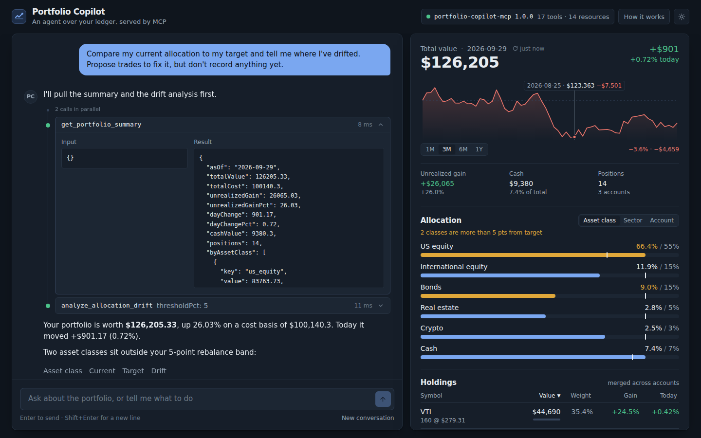

# Portfolio Copilot

A chat agent for an investment portfolio, built on the Model Context Protocol. Ask it how you're doing, where you've drifted from your targets, or what the research desk thinks about a stock, and it answers by calling tools on a custom MCP server. Every call shows up in the conversation, so you can open it and see exactly where a number came from.

Built with Next.js, TypeScript, the Anthropic API and the MCP TypeScript SDK.



## What's in it

- **Custom MCP server** with 17 tools over three data sources: a portfolio ledger (accounts, holdings, transactions, watchlist, targets), a market-data provider, and internal research notes. Also serves MCP resources and prompts, over HTTP or stdio.
- **Agent loop** on the Anthropic Messages API. Tool definitions are fetched from the MCP server per request, tool calls run concurrently, and everything streams to the browser.
- **Chat UI** where each tool call is a node on a trace rail: open it for the exact input, result and latency. Per-answer stats for turns, time and tokens.
- **Dashboard** read from the same MCP tools: value chart with range control, allocation vs targets, sortable holdings. Light and dark themes.
- **Analytics tools** the agent can call: allocation drift with suggested trades, risk metrics (volatility, Sharpe, drawdown, beta), performance history.

## How it works

```
Browser ──▶ Next.js API route (agent loop) ──▶ Anthropic API
                     │
                     └──▶ MCP server ──▶ ledger · market data · research notes
```

1. The browser posts the conversation to `/api/chat`.
2. The agent connects to the MCP server, lists its tools, and streams a model response.
3. When the model asks for a tool, the agent calls it over MCP, feeds the result back, and repeats until the model is done.
4. The dashboard calls the same tools directly, so there's a single source of truth.

Market data is simulated (deterministic, so the demo is stable and works offline). Swap in a real provider by implementing one interface.

## Run it

You need Node 22 and an [Anthropic API key](https://console.anthropic.com/).

```bash
git clone https://github.com/pritichaudhariii/Portfolio-Copilot.git
cd Portfolio-Copilot
npm install
```

Create `apps/web/.env.local` with your key:

```
ANTHROPIC_API_KEY=sk-ant-...
```

Then start both servers and open <http://localhost:3000>:

```bash
npm run dev
```

Try **Am I off target?** and expand the tool calls. **Buy 10 shares of BND** shows a write flowing through to the dashboard.

If the header says the MCP server is unreachable, run `npm run dev` from the repo root, not from `apps/web`.

## Tools the agent can call

**Read:** `list_accounts` `get_holdings` `get_portfolio_summary` `get_quote` `get_price_history` `get_portfolio_history` `get_transactions` `get_watchlist` `get_target_allocation` `list_securities`

**Analyze:** `analyze_allocation_drift` `compute_risk_metrics` `search_research_notes`

**Write:** `record_transaction` `update_watchlist` `set_target_allocation` `reset_demo_data`

The server also works from Claude Desktop, Claude Code or the MCP Inspector: run it with `--stdio`, or point a client at `http://localhost:3001/mcp`.

## Deploy and test

- `docker compose up --build` runs both services (set `ANTHROPIC_API_KEY` first).
- On Railway, deploy the repo as two services using `apps/web/Dockerfile` and `packages/mcp-server/Dockerfile`; see `.env.example` for the variables.
- `npm test` runs the MCP server suite and an integration test that drives the real agent loop against the real server, no API key needed.

## Layout

```
apps/web/               Next.js app, agent loop (lib/agent.ts), chat and dashboard
packages/mcp-server/    MCP server: tools, resources, prompts, data sources, analytics
docs/                   Screenshot
```

MIT licensed.
